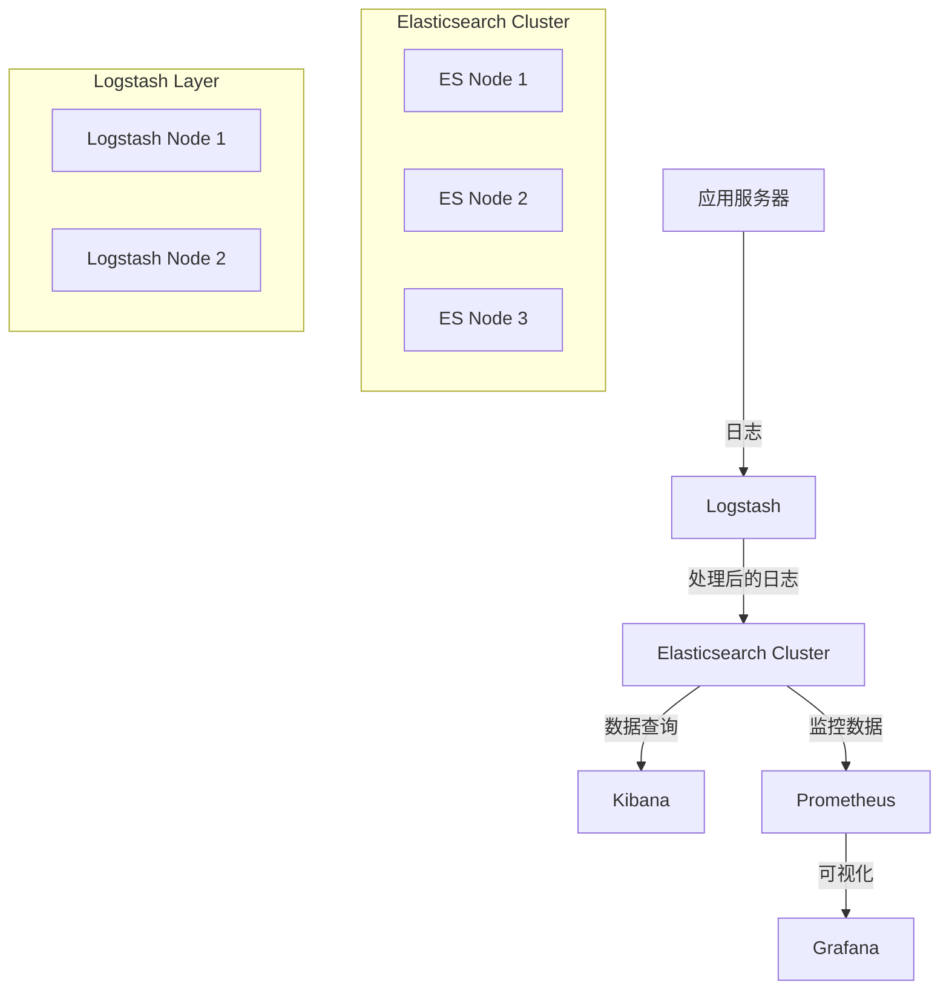

# Copyright (c) 2025 kk
#
# This software is released under the MIT License.
# https://opensource.org/licenses/MIT

# Production ELK Cluster Deployment

生产级 ELK 集群自动化部署方案，包含完整的系统优化配置。

## 🏗️ 架构概览



## 📋 功能特性

### 🔧 系统优化
- **内核参数调优**：vm.max_map_count、网络参数、TCP 优化
- **文件描述符限制**：65536
- **内存锁定**：防止内存交换
- **时区同步**：Asia/Taipei + chrony 配置
- **磁盘 I/O 优化**：read_ahead、调度器优化

### 🛡️ 安全配置
- **X-Pack 安全**：启用认证和授权
- **SSL/TLS 加密**：传输层和 HTTP 层加密
- **系统服务安全**：systemd 安全限制
- **防火墙配置**：精确端口开放

### 📊 性能优化
- **JVM 调优**：G1GC、内存配置、性能参数
- **线程池优化**：写入和搜索队列
- **断路器配置**：防止内存溢出
- **索引优化**：分片和副本配置

## 🚀 快速开始

### 1. 环境准备

```bash
# 安装 Ansible
pip3 install ansible

# 克隆项目
git clone <repository>
cd elk-cluster-deployment
```

### 2. 配置清单

编辑 `inventory/hosts.yml`，配置你的服务器信息：

```yaml
elasticsearch:
  hosts:
    es-node-1:
      ansible_host: 192.168.1.10
    es-node-2:
      ansible_host: 192.168.1.11
    es-node-3:
      ansible_host: 192.168.1.12
```

### 3. 创建密码文件

```bash
# 创建 vault 文件
ansible-vault create group_vars/all/vault.yml
```

添加以下内容：
```yaml
vault_elasticsearch_password: "your_secure_password"
vault_kibana_password: "your_secure_password"
```

### 4. 执行部署

```bash
# 完整部署
ansible-playbook -i inventory/hosts.yml ansible-elk-cluster.yml --ask-vault-pass

# 分步部署
ansible-playbook -i inventory/hosts.yml ansible-elk-cluster.yml --tags system
ansible-playbook -i inventory/hosts.yml ansible-elk-cluster.yml --tags elasticsearch
ansible-playbook -i inventory/hosts.yml ansible-elk-cluster.yml --tags logstash
ansible-playbook -i inventory/hosts.yml ansible-elk-cluster.yml --tags kibana
```

## 📁 项目结构

```
elk-cluster-deployment/
├── ansible-elk-cluster.yml    # 主 playbook
├── ansible.cfg                # Ansible 配置
├── inventory/
│   └── hosts.yml             # 主机清单
├── templates/                 # 配置模板
│   ├── elasticsearch.yml.j2
│   ├── jvm.options.j2
│   ├── elasticsearch.service.j2
│   ├── limits.conf.j2
│   └── chrony.conf.j2
├── group_vars/
│   └── all/
│       └── vault.yml         # 密码文件
└── README.md
```

## 🔧 配置说明

### 系统要求

- **操作系统**：CentOS 9 Stream / RHEL 9
- **内存**：最少 8GB，推荐 16GB+
- **CPU**：最少 4 核，推荐 8 核+
- **磁盘**：SSD 推荐，最少 100GB
- **网络**：千兆网络

### 端口配置

| 服务 | 端口 | 说明 |
|------|------|------|
| Elasticsearch HTTP | 9200 | REST API |
| Elasticsearch Transport | 9300 | 节点间通信 |
| Kibana | 5601 | Web 界面 |
| Logstash Beats | 5044 | Filebeat 输入 |
| Logstash HTTP | 9600 | 监控端口 |

### 性能调优参数

- **JVM 堆内存**：系统内存的 50%
- **文件描述符**：65536
- **虚拟内存映射**：262144
- **TCP 连接优化**：keepalive 配置
- **磁盘水位线**：85%/90%/95%

## 🧪 验证部署

### 1. 检查集群状态

```bash
# 检查 Elasticsearch 集群健康
curl -u elastic:password http://localhost:9200/_cluster/health

# 检查节点信息
curl -u elastic:password http://localhost:9200/_cat/nodes
```

### 2. 检查服务状态

```bash
# 检查服务状态
systemctl status elasticsearch
systemctl status logstash
systemctl status kibana
```

### 3. 访问 Kibana

打开浏览器访问：`http://your-server:5601`

## 🔍 监控和维护

### 日志位置

- **Elasticsearch**：`/var/log/elasticsearch/`
- **Logstash**：`/var/log/logstash/`
- **Kibana**：`/var/log/kibana/`

### 常用命令

```bash
# 查看集群状态
curl -u elastic:password http://localhost:9200/_cluster/health

# 查看索引
curl -u elastic:password http://localhost:9200/_cat/indices

# 查看分片分配
curl -u elastic:password http://localhost:9200/_cat/shards

# 查看节点统计
curl -u elastic:password http://localhost:9200/_nodes/stats
```

## 🛠️ 故障排除

### 常见问题

1. **内存不足**
   - 检查 JVM 堆内存配置
   - 调整 vm.max_map_count

2. **磁盘空间不足**
   - 检查磁盘水位线设置
   - 清理旧索引

3. **网络连接问题**
   - 检查防火墙配置
   - 验证网络连通性

4. **权限问题**
   - 检查 elasticsearch 用户权限
   - 验证目录权限

## 📄 许可证

本项目采用 MIT 许可证。详见 [LICENSE](LICENSE) 文件。

## 🤝 贡献

欢迎提交 Issue 和 Pull Request！

## 📞 支持

如有问题，请提交 Issue 或联系维护者。