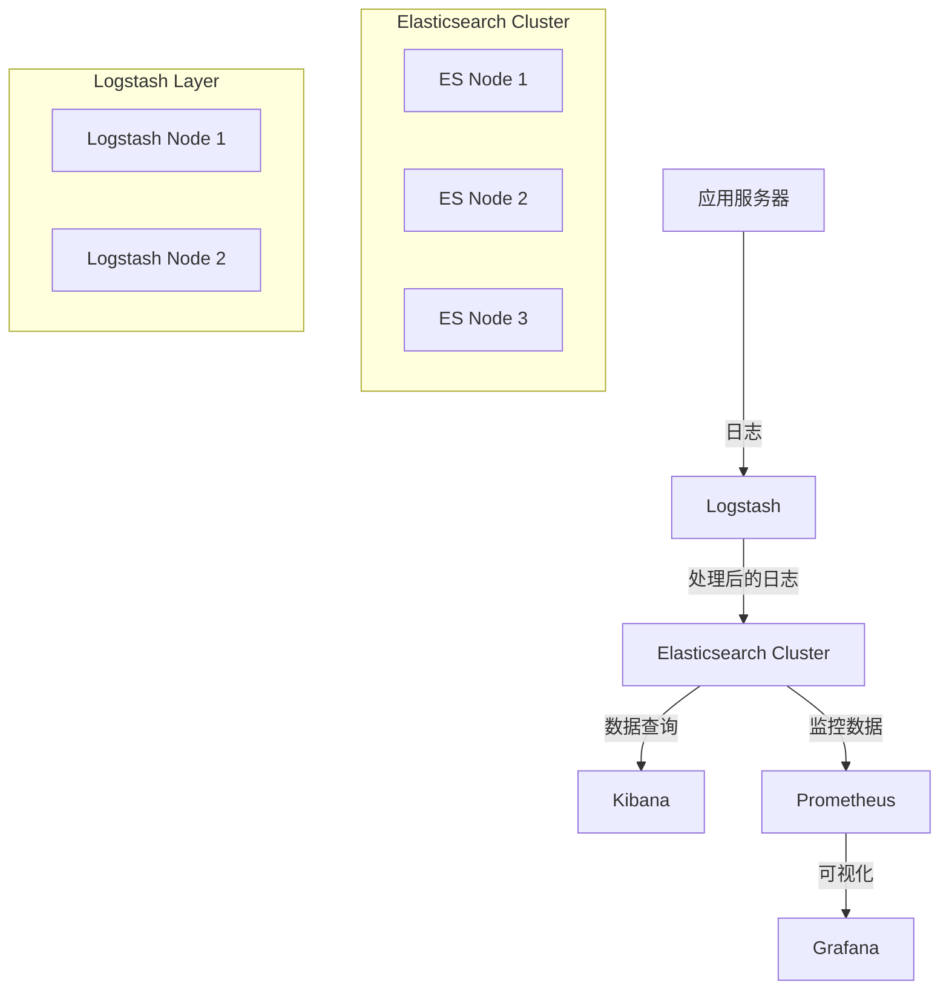

# Copyright (c) 2025 kk
#
# This software is released under the MIT License.
# https://opensource.org/licenses/MIT

# Production ELK Cluster Deployment

生产级 ELK 集群自动化部署方案，包含完整的系统优化配置。

## 🏗️ 架构概览



## 📋 功能特性

### 🔧 系统优化
- **内核参数调优**：vm.max_map_count、网络参数、TCP 优化
- **文件描述符限制**：65536
- **内存锁定**：防止内存交换
- **时区同步**：Asia/Taipei + chrony 配置
- **磁盘 I/O 优化**：read_ahead、调度器优化

### 🛡️ 安全配置
- **X-Pack 安全**：启用认证和授权
- **SSL/TLS 加密**：传输层和 HTTP 层加密
- **系统服务安全**：systemd 安全限制
- **自动密码生成**：安全的密码管理

### 📊 性能优化
- **JVM 调优**：G1GC、内存配置、性能参数
- **线程池优化**：写入和搜索队列
- **断路器配置**：防止内存溢出
- **索引优化**：分片和副本配置

### 🎯 按角色部署
- **模块化部署**：支持按角色分别部署
- **灵活配置**：可单独部署系统配置、Elasticsearch、Logstash、Kibana
- **自动化脚本**：一键部署或分步部署

## 🚀 快速开始

### 1. 环境准备

```bash
# 安装 Ansible
pip3 install ansible

# 克隆项目
git clone <repository>
cd elk-cluster-deployment
```

### 2. 配置清单

编辑 `inventory/hosts.yml`，配置你的服务器信息：

```yaml
elasticsearch:
  hosts:
    devops-elk-es-01:
      ansible_host: 10.170.1.46
    devops-elk-es-02:
      ansible_host: 10.170.1.47
    devops-elk-es-03:
      ansible_host: 10.170.1.48

logstash:
  hosts:
    devops-elk-ls-01:
      ansible_host: 10.170.1.49

kibana:
  hosts:
    devops-elk-kb-01:
      ansible_host: 10.170.1.50
```

### 3. 创建 Vault 密码文件

```bash
# 创建 vault 密码文件
echo "your_secret_vault_password" > .vault_pass.txt
chmod 600 .vault_pass.txt
```

### 4. 执行部署

#### 方法一：一键部署（推荐）

```bash
# 自动生成密码并部署完整集群
./deploy-elk.sh

# 或明确指定完整部署
./deploy-elk.sh --full
```

#### 方法二：分步部署

```bash
# 1. 仅生成密码
./deploy-elk.sh --passwords

# 2. 仅部署完整集群（需要已存在的密码）
./deploy-elk.sh --deploy
```

#### 方法三：按角色部署

```bash
# 1. 生成密码
./deploy-elk.sh --passwords

# 2. 按角色部署（按顺序执行）
./deploy-elk.sh --role system          # 基础系统配置
./deploy-elk.sh --role elasticsearch   # Elasticsearch 集群
./deploy-elk.sh --role logstash        # Logstash 服务
./deploy-elk.sh --role kibana          # Kibana 界面
```

#### 方法四：手动执行

```bash
# 1. 生成密码
ansible-playbook generate-passwords.yml --vault-password-file .vault_pass.txt

# 2. 部署完整集群
ansible-playbook ansible-elk-cluster.yml -i inventory/hosts.yml --vault-password-file .vault_pass.txt \
  --vault-id @passwords/elastic_password.yml \
  --vault-id @passwords/kibana_password.yml \
  --vault-id @passwords/logstash_password.yml \
  --vault-id @passwords/beats_password.yml \
  --vault-id @passwords/monitoring_password.yml \
  --vault-id @passwords/remote_monitoring_password.yml

# 3. 按标签部署特定服务
ansible-playbook ansible-elk-cluster.yml -i inventory/hosts.yml --vault-password-file .vault_pass.txt \
  --tags system
ansible-playbook ansible-elk-cluster.yml -i inventory/hosts.yml --vault-password-file .vault_pass.txt \
  --tags elasticsearch
ansible-playbook ansible-elk-cluster.yml -i inventory/hosts.yml --vault-password-file .vault_pass.txt \
  --tags logstash
ansible-playbook ansible-elk-cluster.yml -i inventory/hosts.yml --vault-password-file .vault_pass.txt \
  --tags kibana
```

## 📁 项目结构

```
elk-cluster-deployment/
├── ansible-elk-cluster.yml    # 主 playbook（按角色部署）
├── generate-passwords.yml     # 密码生成 playbook
├── deploy-elk.sh              # 一键部署脚本
├── ansible.cfg                # Ansible 配置
├── inventory/
│   └── hosts.yml             # 主机清单
├── templates/                 # 配置模板
│   ├── elasticsearch.yml.j2
│   ├── jvm.options.j2
│   ├── elasticsearch.service.j2
│   ├── logstash.yml.j2
│   ├── logstash.service.j2
│   ├── kibana.yml.j2
│   ├── kibana.service.j2
│   ├── limits.conf.j2
│   └── chrony.conf.j2
├── passwords/                 # 密码文件目录（自动生成）
├── .vault_pass.txt           # Vault 密码文件
├── .gitignore                # Git 忽略文件
├── PASSWORD_MANAGEMENT.md    # 密码管理文档
└── README.md
```

## 🔧 配置说明

### 系统要求

- **操作系统**：CentOS 9 Stream / RHEL 9
- **内存**：最少 8GB，推荐 16GB+
- **CPU**：最少 4 核，推荐 8 核+
- **磁盘**：SSD 推荐，最少 100GB
- **网络**：千兆网络

### 端口配置

| 服务 | 端口 | 说明 |
|------|------|------|
| Elasticsearch HTTP | 9200 | REST API |
| Elasticsearch Transport | 9300 | 节点间通信 |
| Kibana | 5601 | Web 界面 |
| Logstash Beats | 5044 | Filebeat 输入 |
| Logstash HTTP | 9600 | 监控端口 |

### 性能调优参数

- **JVM 堆内存**：系统内存的 50%
- **文件描述符**：65536
- **虚拟内存映射**：262144
- **TCP 连接优化**：keepalive 配置
- **磁盘水位线**：85%/90%/95%

## 🧪 验证部署

### 1. 检查集群状态

```bash
# 检查 Elasticsearch 集群健康
curl -u elastic:password http://localhost:9200/_cluster/health

# 检查节点信息
curl -u elastic:password http://localhost:9200/_cat/nodes
```

### 2. 检查服务状态

```bash
# 检查服务状态
systemctl status elasticsearch
systemctl status logstash
systemctl status kibana
```

### 3. 访问 Kibana

打开浏览器访问：`http://your-server:5601`

## 🔍 监控和维护

### 日志位置

- **Elasticsearch**：`/var/log/elasticsearch/`
- **Logstash**：`/var/log/logstash/`
- **Kibana**：`/var/log/kibana/`

### 常用命令

```bash
# 查看集群状态
curl -u elastic:password http://localhost:9200/_cluster/health

# 查看索引
curl -u elastic:password http://localhost:9200/_cat/indices

# 查看分片分配
curl -u elastic:password http://localhost:9200/_cat/shards

# 查看节点统计
curl -u elastic:password http://localhost:9200/_nodes/stats
```

## 🛠️ 故障排除

### 常见问题

1. **内存不足**
   - 检查 JVM 堆内存配置
   - 调整 vm.max_map_count

2. **磁盘空间不足**
   - 检查磁盘水位线设置
   - 清理旧索引

3. **网络连接问题**
   - 检查防火墙配置
   - 验证网络连通性

4. **权限问题**
   - 检查 elasticsearch 用户权限
   - 验证目录权限

5. **证书问题**
   - 检查 elastic-certificates.p12 文件
   - 验证证书密码配置

## 📄 许可证

本项目采用 MIT 许可证。详见 [LICENSE](LICENSE) 文件。

## 🤝 贡献

欢迎提交 Issue 和 Pull Request！

## 📞 支持

如有问题，请提交 Issue 或联系维护者。